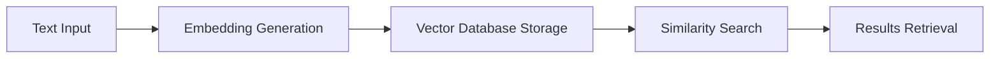

# AI Engineering Learning Path: From Beginner to Professional

## Introduction

Welcome to the comprehensive guide for becoming an AI Engineer! This learning path is specifically designed for individuals with little to no programming experience who want to enter the field of AI Engineering. The curriculum is structured to take you from basic programming concepts to advanced AI implementation over a period of 10-11 months, with an estimated study time of 2-3 hours per day.

## Overview

The journey to becoming an AI Engineer is divided into four main phases:

1. **Foundation Phase** (2-3 months)
   - Python programming fundamentals
   - Development environment setup
   - Data manipulation basics

2. **AI Fundamentals** (2-3 months)
   - Introduction to AI/ML concepts
   - Working with LLMs
   - Basic implementation skills

3. **AI Implementation** (3-4 months)
   - Advanced OpenAI integration
   - Vector databases and embeddings
   - RAG system development

4. **Advanced AI Engineering** (3-4 months)
   - AI agents development
   - Multimodal AI applications
   - Production system deployment

## Prerequisites

- A computer with internet connection
- Basic understanding of computer operations
- Dedication to consistent learning (2-3 hours daily)
- No prior programming experience required

## Learning Path Structure

Each phase of the learning path is carefully structured to build upon previous knowledge, with practical projects and hands-on exercises to reinforce learning. The curriculum emphasizes practical implementation over theoretical concepts, focusing on real-world applications of AI technology.

## Phase 1: Foundation (2-3 months)

### Week 1-2: Development Environment Setup
- **Duration**: 2 weeks
- **Goals**:
  - Understanding of development environments
  - Basic command line operations
  - Git fundamentals for version control

#### Setting Up Your Environment
1. Install Python (latest stable version)
2. Install Conda using Miniconda
   ```bash
   # Windows
   # Download Miniconda from official website
   
   # macOS/Linux
   wget https://repo.anaconda.com/miniconda/Miniconda3-latest-Linux-x86_64.sh
   bash Miniconda3-latest-Linux-x86_64.sh
   ```

3. Create and activate a conda environment
   ```bash
   conda create -n aienv python=3.10
   conda activate aienv
   ```

4. Install Jupyter
   ```bash
   conda install jupyter
   ```

### Week 3-6: Python Fundamentals
- **Duration**: 4 weeks
- **Topics**:
  - Variables and data types
  - Control structures
  - Functions and modules
  - Object-oriented programming basics
  - Error handling

#### Practice Projects:
1. Command line calculator
2. Simple text-based game
3. File manipulation utility

### Week 7-8: Data Manipulation Fundamentals
- **Duration**: 2 weeks
- **Topics**:
  - NumPy basics
  - Pandas fundamentals
  - Data visualization with Matplotlib
  - Basic data cleaning and preparation

#### Required Libraries:
```bash
conda install numpy pandas matplotlib
```

## Phase 2: AI Fundamentals (2-3 months)

### Week 9-10: Introduction to AI/ML
- **Duration**: 2 weeks
- **Topics**:
  - Basic AI concepts
  - Types of AI systems
  - Understanding LLMs
  - AI ethics and safety

### Week 11-14: Working with Pre-trained Models
- **Duration**: 4 weeks
- **Topics**:
  - OpenAI API basics
  - Hugging Face fundamentals
  - Prompt engineering principles
  - Token management

#### Sample OpenAI Integration:
```python
import openai

def basic_completion(prompt):
    response = openai.ChatCompletion.create(
        model="gpt-3.5-turbo",
        messages=[
            {"role": "user", "content": prompt}
        ]
    )
    return response.choices[0].message.content
```

### Week 15-16: Basic AI Implementation
- **Duration**: 2 weeks
- **Projects**:
  - Build a simple chatbot
  - Create a text classification system
  - Implement basic prompt engineering

## Phase 3: AI Implementation (3-4 months)

### Week 17-20: Advanced OpenAI Integration
- **Duration**: 4 weeks
- **Topics**:
  - Function calling
  - Assistant API
  - Advanced prompt engineering
  - System message design

### Week 21-24: Vector Databases and Embeddings
- **Duration**: 4 weeks
- **Topics**:
  - Understanding embeddings
  - Vector database implementation
  - Semantic search
  - Implementation with various databases



### Week 25-28: RAG Systems
- **Duration**: 4 weeks
- **Topics**:
  - RAG architecture
  - Document processing
  - Context window management
  - Response generation

#### Basic RAG Implementation:
```python
from langchain.embeddings import OpenAIEmbeddings
from langchain.vectorstores import Chroma
from langchain.text_splitter import CharacterTextSplitter
from langchain.llms import OpenAI
from langchain.chains import RetrievalQA

def setup_rag_system(documents):
    # Document processing
    text_splitter = CharacterTextSplitter(chunk_size=1000, chunk_overlap=0)
    texts = text_splitter.split_documents(documents)
    
    # Create embeddings and vector store
    embeddings = OpenAIEmbeddings()
    vectorstore = Chroma.from_documents(texts, embeddings)
    
    # Create QA chain
    qa = RetrievalQA.from_chain_type(
        llm=OpenAI(),
        chain_type="stuff",
        retriever=vectorstore.as_retriever()
    )
    return qa
```

## Phase 4: Advanced AI Engineering (3-4 months)

### Week 29-32: AI Agents
- **Duration**: 4 weeks
- **Topics**:
  - Agent architectures
  - Tool use and function calling
  - Memory systems
  - Planning and execution

### Week 33-36: Multimodal AI
- **Duration**: 4 weeks
- **Topics**:
  - Image processing with DALL-E
  - Audio processing with Whisper
  - Video understanding
  - Multimodal applications

### Week 37-40: Production Systems
- **Duration**: 4 weeks
- **Topics**:
  - System architecture
  - API development
  - Monitoring and logging
  - Cost optimization
  - Security best practices

## Continuous Learning and Best Practices

### Best Practices
1. Always start with problem definition
2. Consider ethical implications
3. Implement proper error handling
4. Monitor token usage and costs
5. Maintain security best practices

### Resources for Continued Learning
- OpenAI documentation
- Hugging Face documentation
- AI engineering blogs
- GitHub repositories
- Online courses and tutorials

## Project Portfolio Suggestions

### Beginner Projects
1. AI-powered content summarizer
2. Simple chatbot with personality
3. Document classification system

### Intermediate Projects
1. RAG-based knowledge base
2. AI-powered content generation system
3. Multimodal content analyzer

### Advanced Projects
1. AI agent for task automation
2. Enterprise search system
3. Multi-agent collaboration system

## Next Steps
After completing this curriculum, consider:
1. Contributing to open-source AI projects
2. Building production-ready applications
3. Specializing in specific AI domains
4. Participating in AI communities

Remember that AI Engineering is a rapidly evolving field. Stay updated with the latest developments and continuously adapt your skills to new technologies and methodologies.
